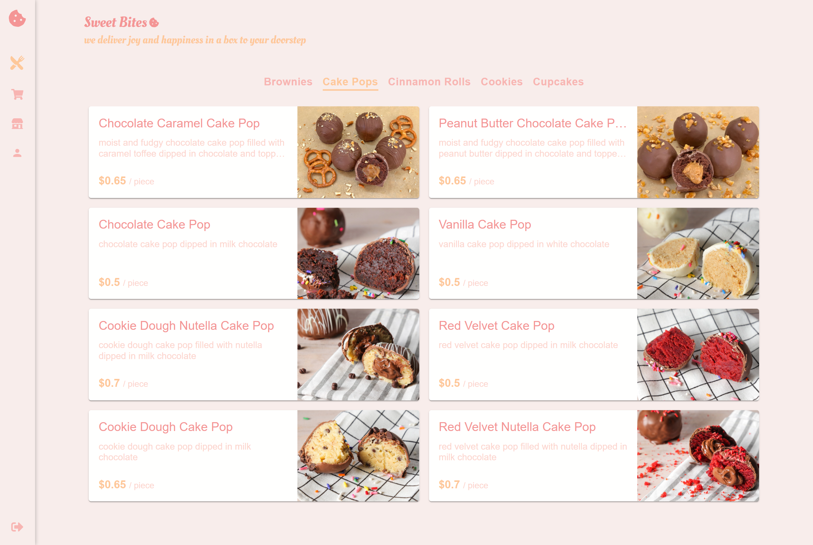

# Online Bake Shop v2 - In Progress 🚧

This project is an updated version of an academic project, Online Bake Shop. Version 2 is currently in progress.

## 🚀 What's New in Version 2?

- Improved UI and UX
- Optimized performance
- New features (to be announced)

## 📌 Work in Progress

The following features are not yet completed:

- Authentication
- Cart
- About us
- Profile

## 🛠 Tech Stack

- **Frontend:** React.js
- **Backend:** .NET
- **State Management:** Redux
- **Styling:** CSS / SASS, MUI, Tailwind CSS
- **Database:** SQLite

## 💻 How to Run the App

### Backend Setup

1. Navigate to the folder:
   ```sh
   cd CMPS278Project
   ```
2. Install dependencies:
   ```sh
   dotnet restore
   ```
3. Run the backend server:
   ```sh
   dotnet run
   ```

### Frontend Setup

1. Navigate to the frontend folder:
   ```sh
   cd ClientApp
   ```
2. Install dependencies:
   ```sh
   npm install
   ```
3. Run the app:
   ```sh
   npm start
   ```
---

## 📸 Screenshots




